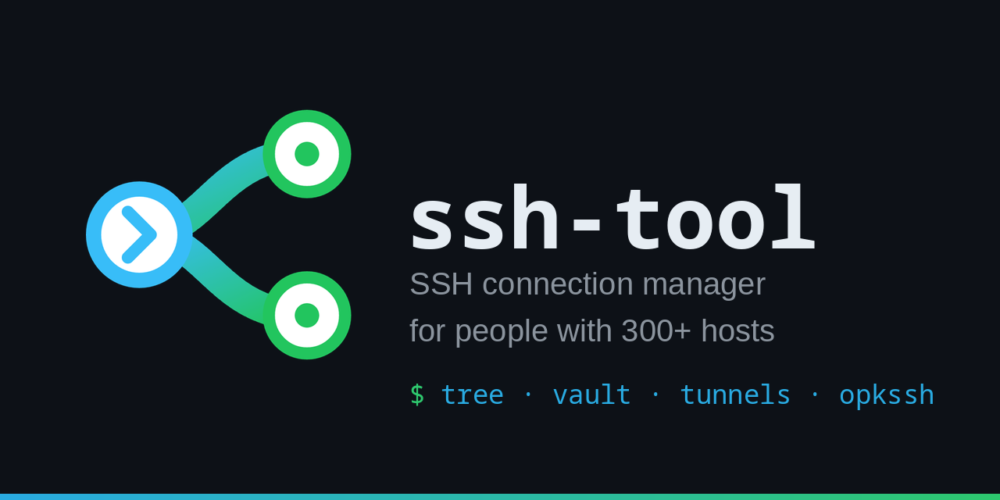

# ssh-tool

Daily-driver SSH manager for sysadmins with 300+ hosts: folder-
inherited tree, encrypted vault, multi-tab split-pane terminal,
native multi-window, SOCKS5 forwards, batch exec, RDM import.

Built on Wails v3 (beta) + Svelte 5 + Go. Single binary, cross-
platform (Windows / Linux native; macOS scaffolding exists but
test status varies).

> Looking for a longer pitch? See [`docs/APP_DESCRIPTION.md`](docs/APP_DESCRIPTION.md).

## Highlights

- **Connection tree** with folder-level inherited settings, tags,
  multi-select batch editor.
- **Encrypted credential vault** - Argon2id + XChaCha20-Poly1305,
  file-only persistence with an optional machine-bound auto-unlock
  sidecar (no OS keychain - removed in v0.12.8), idle auto-lock,
  password strength meter.
- **Multi-window, multi-tab, multi-pane** terminal with native
  detach / redock and broadcast input across windows.
- **Workspaces** - named tab bundles you switch between with one
  click; tabs carry group chips.
- **Dynamic inventory** - auto-populated folders from Proxmox VE,
  Hetzner Cloud, DigitalOcean, Linode, Vultr, Scaleway, AWS EC2 and
  Ansible static inventory, with tag/label filters, hide-stopped,
  live load bars + Raw payload in the detail pane.
- **Power tools** - live tcpdump panel (smart sudo), HTTP/SOAP
  request modal over SOCKS5, parallel batch command exec across a
  multi-selection, snippet library (Ctrl+Shift+P), markdown notes.
- **Share a session** - to a plain web browser (a colleague watches,
  or types in with your approval; encrypted, per-guest word-code
  confirmation, no cloud relay) or to an external LLM over MCP.
- **opkssh** native (no external binary) certificate flow.
- **SFTP** browser with native OS drag-and-drop upload, a paste-able
  path bar, owner/group names, and quick view + in-place editing with
  syntax highlighting (mode and CRLF/LF endings preserved on save).
- **Port forwards** - local / remote / SOCKS5 dynamic with
  isolated-browser launcher.
- **Imports** from Devolutions RDM JSON, ssh_config, MobaXterm
  `.mxtsessions`, PuTTY / KiTTY `.reg` and SuperPuTTY `Sessions.xml`;
  encrypted archive export.

## Documentation

- [User guide](docs/USER_GUIDE.md) - every shipped feature, indexed.
- [App description](docs/APP_DESCRIPTION.md) - copy for
  README / web / store at four lengths.
- [TODO / backlog](docs/TODO.md) - open items grouped by area.
- [CHANGELOG](CHANGELOG.md) - release notes.
- [Architecture](docs/02-architecture.md), [data model](docs/03-data-model.md),
  [security](docs/06-security.md) - design references.
- [Gotchas](docs/gotchas.md) - implementation traps archive
  (subsystem-grouped).

## Build

### Requirements

- Go 1.25+ (`go.mod` is the source of truth)
- Node 20+
- [`wails3` CLI](https://wails.io) (beta) - `go install github.com/wailsapp/wails/v3/cmd/wails3@v3.0.0-beta.8`
- [Task](https://taskfile.dev) - `go install github.com/go-task/task/v3/cmd/task@latest`

### Build for your platform

```bash
task build
```

Output lands in `bin/`. On Windows the binary is `ssh-tool.exe`.

### Cross-build Windows from Linux

```bash
CGO_ENABLED=0 task windows:build
```

### Dev mode (hot reload)

```bash
# Terminal 1
cd frontend && npm install && npm run dev

# Terminal 2
FRONTEND_DEVSERVER_URL=http://localhost:5173 go run .
```

WSL? Add the GTK4 workarounds (see `CLAUDE.md`):

```bash
GDK_BACKEND=x11 WEBKIT_DISABLE_DMABUF_RENDERER=1 \
  WEBKIT_DISABLE_COMPOSITING_MODE=1 LIBGL_ALWAYS_SOFTWARE=1 \
  FRONTEND_DEVSERVER_URL=http://localhost:5173 go run .
```

## Project layout

```
ssh-tool/
├─ main.go            shared entrypoint (desktop + android split by build tag)
├─ app.go             IPC service exposed to the frontend (+ app_*.go)
├─ internal/
│  ├─ store/          SQLite + migrations + CRUD (+ audit.db)
│  ├─ creds/          vault crypto + lifecycle
│  ├─ ssh/            session, jump chain, forwards, sftp, tcpdump, batch
│  ├─ inventory/      dynamic providers (Proxmox, Hetzner, DO, AWS, ...)
│  ├─ httpc/          HTTP / SOAP request runner with SOCKS5 dialer
│  ├─ resolver/       inheritable-settings resolver (folder -> conn)
│  ├─ local/          in-app local PTY (Win/Mac/Linux shells)
│  ├─ exporter/       encrypted archive export / import
│  ├─ importer/       RDM, ssh_config, MobaXterm, PuTTY, SuperPuTTY
│  ├─ wg/             userspace WireGuard network profiles
│  ├─ tunnelhelper/   sidecar plugin manager (NetBird, Tailscale)
│  ├─ keepass/        .kdbx credential backend
│  ├─ bitwarden/      Bitwarden / Vaultwarden credential backend
│  ├─ infisical/      Infisical credential backend
│  ├─ syncer/         encrypted WebDAV + cloud profile sync
│  ├─ backup/         encrypted store+vault snapshots, scheduler
│  ├─ recorder/       asciicast v2 session recording
│  ├─ share/          session sharing (browser guest, MCP)
│  ├─ presence/       LAN presence for shared sessions
│  ├─ updater/        in-app update check + staged install
│  └─ initcmd/        initial-command sequencing
├─ netbird-helper/    optional sidecar plugin (separate module)
├─ tailscale-helper/  optional sidecar plugin (separate module)
├─ frontend/          Svelte 5 + xterm.js
└─ docs/              user guide, app description, TODO, etc.
```

See [`CLAUDE.md`](CLAUDE.md) for an exhaustive handoff document
intended for new contributors (or future Claude Code instances).

## Status

Active development. Wails v3 is still a prerelease upstream (beta
since 2026-08-02), so expect occasional breakage when bumping. The
project started as a Rust + Tauri app and was ported to Go - do
**not** reintroduce russh-based code; we moved to Go specifically
because `russh`'s forked `ssh-key`
crate rejects opkssh "forever" certs (`valid_before=u64::MAX`) and
rewriting them breaks the CA signature.

Current release: see the latest `v*` tag on `main` and
[CHANGELOG.md](CHANGELOG.md). Builds are published at
[sshtool.app](https://sshtool.app).

## License

[Apache License 2.0](LICENSE). Copyright 2026 Filip Penezic.
